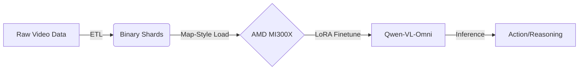

# KAIØ-SIGHT 🚀

<div align="center">

**Multi-View Vision-Language Reasoning for Autonomous Robotics**

[](LICENSE)
[](https://www.python.org/)
[](https://rocm.docs.amd.com/)
[](https://huggingface.co/Thunderbird2410/KAIO-SIGHT)
[]()

</div>

---

> [!IMPORTANT]
> **Experimental Research Preview**
> This project is a research prototype designed specifically for **AMD MI300X GPUs**. It relies on bleeding-edge ROCm libraries and custom kernel optimizations. Performance and stability on other hardware (NVIDIA/Intel) are not guaranteed.

---

## 🎯 The Problem: Spatial-Temporal Reasoning in Robotics

Autonomous vehicles and mobile robots operate in a complex, 360-degree world. Traditional vision models often process cameras independently or lack the temporal context to understand *motion* and *causality*.

**Key Challenges:**
1.  **Multi-View Synchronization**: Stitching together disjoint camera feeds (Front, Rear, Left, Right) into a coherent spatial representation.
2.  **Temporal Dynamics**: Understanding not just *where* an object is, but *where it is going* based on past frames.
3.  **High-Throughput Training**: Processing high-resolution video streams from 7+ cameras requires massive compute and memory bandwidth.

## 💡 The Solution: AMD-Vision-Omni

**AMD-Vision-Omni** is an end-to-end training pipeline designed to fine-tune Large Vision-Language Models (VLMs) to "think" like a robot. By fusing multi-view video data into a unified spatial-temporal context, the model learns to predict egomotion and reason about driving scenarios.

### Why AMD MI300X?
This project leverages the massive 192GB VRAM and high memory bandwidth of the MI300X to handle:
-   **Long Context Windows**: Up to 65,536 tokens for extended video sequences.
-   **Large Batch Sizes**: Efficient gradient accumulation without OOM errors.
-   **Native Bfloat16**: Accelerated training with mixed precision.


## 📊 Dataset

This project uses the sample [NVIDIA PhysicalAI Autonomous Vehicles](https://huggingface.co/datasets/nvidia/PhysicalAI-Autonomous-Vehicles) dataset (full data set is 73TB +), which provides:

- Multi-camera video streams (7 cameras, various FOVs)
- Egomotion labels (position, velocity, rotation)
- High-quality driving scenarios

### Camera Configurations

| Setup | Cameras | Grid Layout |
|-------|---------|-------------|
| 4-cam | Front Wide, Front Tele, Rear Left, Rear Right | 2×2 |
| 7-cam | 4-cam + Cross Left, Cross Right, Rear Tele | 3×3 |

---

## 🗺️ Navigating the Repository

This codebase is organized into modular components for Data ETL, Training, and Inference.

| Directory | Description |
| :--- | :--- |
| **`scripts/`** | **Start Here.** Orchestration scripts for the full pipeline.<br>• `01_setup_data.sh`: Automated Data ETL.<br>• `02_finetune.sh`: Training & Model Push.<br>• `03_inference.sh`: Run predictions. |
| **`src/data_etl/`** | **The Engine Room.** Handles raw video processing.<br>• `prepare_dataset.py`: GPU-accelerated video tiling and tokenization.<br>• `loader.py`: Custom PyTorch dataset for multi-view sequences. |
| **`src/training/`** | **The Brain.** Training logic and optimizations.<br>• `trainer.py`: Main training loop with Unsloth integration.<br>• `callbacks.py`: Automated telemetry and reporting. |
| **`configs/`** | **Control Panel.** YAML configuration files.<br>• `finetuning_config.yaml`: Hyperparameters (LR, Epochs, LoRA).<br>• `data_config.yaml`: Dataset sources and processing rules. |
| **`docs/`** | **Knowledge Base.** Detailed documentation.<br>• [Architecture](./docs/architecture/README.md)<br>• [Data Setup](./docs/data_setup/README.md)<br>• [Finetuning](./docs/finetuning/README.md) |

---

## 📂 Project Structure

```
AMD-Vision-Omni/
├── configs/
│   ├── data_config.yaml        # Dataset and download settings
│   └── finetuning_config.yaml  # Model and training hyperparameters
├── data/
│   ├── shards/                 # Processed binary Arrow shards (Ready for training)
│   ├── camera/                 # Raw video clips
│   ├── labels/                 # Kinematic labels
│   └── clip_index.parquet      # Dataset manifest
├── docs/                       # Detailed documentation
│   ├── architecture/           # System design & hardware optimization
│   ├── data_setup/             # Sourcing & preprocessing guides
│   ├── finetuning/             # Training pipeline & reporting
│   ├── inference/              # Inference guides
│   ├── data_audit/             # Data audit reports
│   └── reports/                # Decision logs & post-finetuning reports
├── scripts/
│   ├── 01_setup_data.sh        # Download -> Audit -> ETL -> Cache
│   ├── 02_finetune.sh          # Train -> Save -> Push
│   ├── 03_inference.sh         # Load -> Predict
│   ├── analysis/               # Data analysis tools
│   └── debug/                  # Debugging tools
├── src/
│   ├── data_etl/               # Data pipeline (ETL)
│   ├── inference/              # Inference logic
│   ├── models/                 # Model architecture & helpers
│   └── training/               # Training loop & callbacks
├── checkpoints/                # Training outputs
├── requirements.txt
└── LICENSE
```

---

## 🚀 Quick Start

### Prerequisites
-   **Hardware**: AMD MI300X GPU (or compatible ROCm device).
-   **OS**: Linux (Ubuntu 22.04 recommended).
-   **Storage**: 73TB NVMe SSD for the full dataset (600GB+ SSD required for comfortable e2e run for 33,000+samples ).

### Installation

```bash
git clone https://github.com/poornachandra24/AMD-Vision-Omni.git
cd AMD-Vision-Omni

python -m venv .venv
source .venv/bin/activate
pip install -r requirements.txt
```


### Running the Pipeline

The entire workflow is automated via the `scripts/` directory:

```bash
# 1. Download & Process Data (ETL)
./scripts/01_setup_data.sh

# 2. Train the Model
./scripts/02_finetune.sh

# 3. Run Inference
./scripts/03_inference.sh
```

---

## 🏗️ Architecture Overview



-   **Base Model**: `Qwen2.5-VL-7B-Instruct`
-   **Training Method**: 16-bit LoRA (Bfloat16) with Unsloth
-   **Data Format**: Pre-tokenized binary shards (Arrow) for zero-overhead loading.

---
## Acknowledgments

- [Unsloth](https://github.com/unslothai/unsloth) for efficient LLM fine-tuning
- [Qwen-VL](https://github.com/QwenLM/Qwen-VL) for the vision-language model
- [NVIDIA](https://huggingface.co/nvidia) for the PhysicalAI dataset
- [AMD ROCm](https://rocm.docs.amd.com/) for GPU compute support

## 📄 License

This project is licensed under the MIT License. See [LICENSE](LICENSE) for details.

---

<div align="center">
    <b>Experimental Code - Use at your own risk.</b><br>
</div>