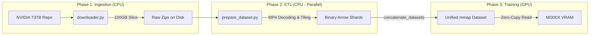

# Project KAIO-SIGHT: A High-Throughput Physical AI Agent

**Project KAIO-SIGHT is an end-to-end AI system for training a "Thinking" Vision-Language Model (VLM) on high-fidelity, multi-camera autonomous driving data. This architecture is specifically designed to saturate the 192GB HBM3 memory and 240GB System RAM of the AMD Instinct MI300X.**

This system moves beyond simple image captioning to **Physical AI**, where the model learns to correlate visual motion with kinematic data to predict trajectories.


---

## 1. Core Architectural Features

This is not a simple training script; it is a production-grade orchestration pipeline built for 2026-tier AI development.

-   **Decoupled ETL Architecture**: To prevent the MI300X from "starving" for data, the system uses a two-stage process. A one-time, CPU-intensive ETL script decodes and prepares the data, allowing the GPU training stage to run with >95% utilization.
-   **Crash-Proof, Resumable ETL**: The ETL engine uses OS-Level Parallelism to bake the data into independent "shards." If the multi-hour process crashes, it can be restarted and will automatically skip any shards that are already complete.
-   **Consolidated Memory-Mapped Dataset**: The trainer loads all processed shards into a single, unified "Map-Style" dataset. This leverages Hugging Face `datasets`' **memory-mapping (`mmap`)**, which creates pointers to the data on the 5TB NVMe drive instead of loading hundreds of gigabytes into active RAM. This provides the performance of in-memory access with the scalability of on-disk storage.
-   **Hardware-Native Performance (MI300X)**: The trainer is optimized to use the MI300X's native **Bfloat16 precision**, disabling 4-bit quantization to achieve maximum throughput and numerical stability.

---

## 2. System Architecture & Design

The system is built on a **State-Aware Orchestration** model. A master shell script (`scripts/01_setup_data.sh`) audits the system state and decides whether to download data, run the ETL process, or start the GPU training.

### Data Lifecycle & Flow

The data journey is designed to maximize throughput and minimize latency at the training stage.



See [System Architecture](./architecture/system_design.md) for more details.

---

## 3. The Data Pipeline Explained

### 3.1. Understanding `target_chunks` vs. Sample Count

Setting `target_chunks: 1` can result in over 33,000 training samples. This reveals the "nested" nature of the NVIDIA NuRec dataset.

> **Architect's Insight:**
>
> -   **`target_chunks: 1`** instructs the `downloader.py` to download a single "chunk" file (e.g., `camera_front_wide_120fov.chunk_0000.zip`).
> -   However, this one `.zip` file contains **hundreds of individual `.mp4` video clips**, each with a unique ID (UUID).
> -   The ETL script (`prepare_dataset.py`) opens that single chunk, finds all clips inside, and processes **every single one**.
> -   Each 20-second clip yields approximately 20-30 training "windows" (16 frames each).
> -   **The Math:** `1 Chunk` $\times$ `~100 Clips/Chunk` $\times$ `~28 Samples/Clip` = **Thousands of training samples from a single downloaded unit.** The 33,137 samples are the result of processing *all clips* from *all chunks* currently on disk.

### 3.2. Data Lifecycle Stages

1.  **Selective Slicing**: The `downloader.py` pulls only the required camera and label `.zip` files for the target chunks.
2.  **Offline ETL (`prepare_dataset.py`)**: This script uses **OS-Level Parallelism** with `ProcessPoolExecutor` to distribute the workload.
    -   **Linear Video Decoding**: For each clip, the MP4 is read sequentially to avoid the slow "seek penalty."
    -   **On-the-Fly Resizing**: Frames are resized to a VRAM-friendly 504px immediately after decoding.
    -   **Sharded Checkpointing**: The processed samples are saved into small, independent "shard" folders, making the process resumable.
3.  **Light-Speed Loading**: The `trainer.py` discovers all completed shards, uses `concatenate_datasets` to create a single virtual dataset, and then accesses the data at PCIe speeds via memory-mapping.

See [Data Lifecycle](./architecture/data_lifecycle.md) for deep dive.

---

## 4. Architectural Decision Log

| Challenge | Root Cause | Architectural Solution |
| :--- | :--- | :--- |
| **`BrokenProcessPool` Error** | **OpenCV is not fork-safe.** Python's `multiprocessing` pool created corrupted thread states, causing silent segfaults in worker processes. | **Pivot to OS-Level Parallelism & `spawn` Context.** Re-architected `prepare_dataset.py` to be a single-shard worker launched by a Bash script, and forced the multiprocessing context to `spawn` for clean memory isolation. |
| **Extreme Slowness (~7s/sample)** | **I/O Starvation ("Triple Tax").** 1) Re-extracting MP4s from ZIPs for every sample. 2) Slow `cv2.seek()` on compressed video. 3) Multiple processes fighting over the same file handles. | **Implement a Decoupled, Clip-Centric ETL Pipeline.** The `prepare_dataset.py` script now processes data clip-by-clip, reading each video linearly once, which is 10-20x faster. |
| **High RAM Usage during Training** | **Loading hundreds of GBs of processed data.** A naive approach of loading all shards into memory would exhaust the 240GB of system RAM. | **Leverage Hugging Face `datasets` Memory-Mapping.** Instead of a custom `IterableDataset`, the final architecture uses `concatenate_datasets`. This creates a unified "Map-Style" dataset that uses `mmap` to access data directly from the NVMe disk, keeping active RAM usage low. |
| **Tensor Shape Mismatch** | **Collator/Model Disagreement.** The `SFTTrainer` was not correctly interpreting the list of 16 video frames. | **Implement the `UnslothVisionDataCollator`** and refactor the formatting function to separate the text prompt from the raw image list, allowing the collator to handle the tensorization correctly. |

See [Full Decision Log](./reports/decision_log.md).

---

## 5. Experiment Tracking

This project uses [Comet ML](https://www.comet.com/) for comprehensive experiment tracking during both training and inference:

-   **Training Metrics**: Loss curves, learning rates, VRAM usage, and hardware telemetry are automatically logged.
-   **Inference Evaluation**: Model performance is tracked across different HuggingFace adapter commits.
-   **Live Dashboard**: View real-time inference results at the [Inference Test Dashboard](https://www.comet.com/poornachandra24/kaio-sight-inference-test/view/new/panels).

All training runs automatically log to Comet ML with detailed hardware metrics (VRAM, power consumption) and model performance indicators.

---

## 6. Execution Workflow

### Step 1: Data Ingestion & ETL (Run ONCE)
This is the longest step. It will download the raw data (if missing) and then use all available CPU cores to bake it into the binary format.

```bash
# Launch the Data Setup Protocol
./scripts/01_setup_data.sh
```

### Step 2: Iterative Training
Once the ETL is complete, you can run training experiments in minutes. Metrics are automatically logged to Comet ML.

```bash
# Launch the GPU training
./scripts/02_finetune.sh
```
*To run for a different number of epochs or with a different learning rate, simply edit `configs/finetuning_config.yaml` and re-run this script.*

### Step 3: Inference
Test the trained model on a sample video.

```bash
# Launch Inference
./scripts/03_inference.sh
```
