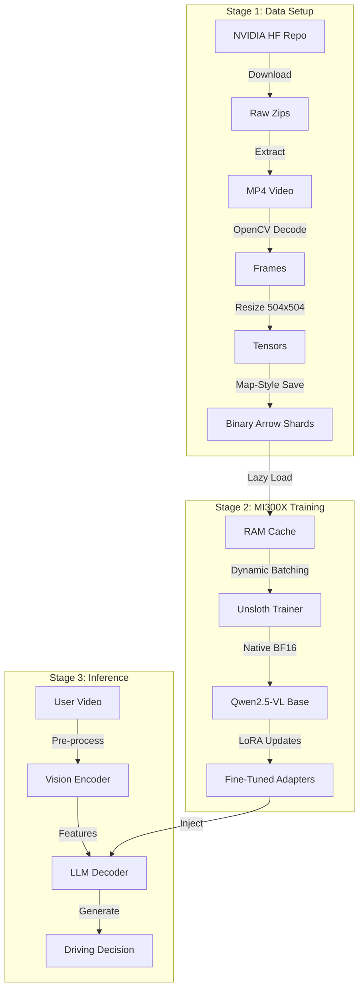

# 🏗️ System Architecture

## High-Level System Design
The KAIO-SIGHT system is designed as a high-throughput factory for converting raw autonomous vehicle video into reasoning capabilities.

## Model Architecture
*   **Backbone:** Qwen2.5-VL-7B-Instruct
*   **Vision Tower:** Internally handles dynamic resolution (up to 4096px), clamped to 504px for stability.
*   **Adapter:** Low-Rank Adaptation (LoRA) targeting `q_proj`, `k_proj`, `v_proj`, `o_proj`.
