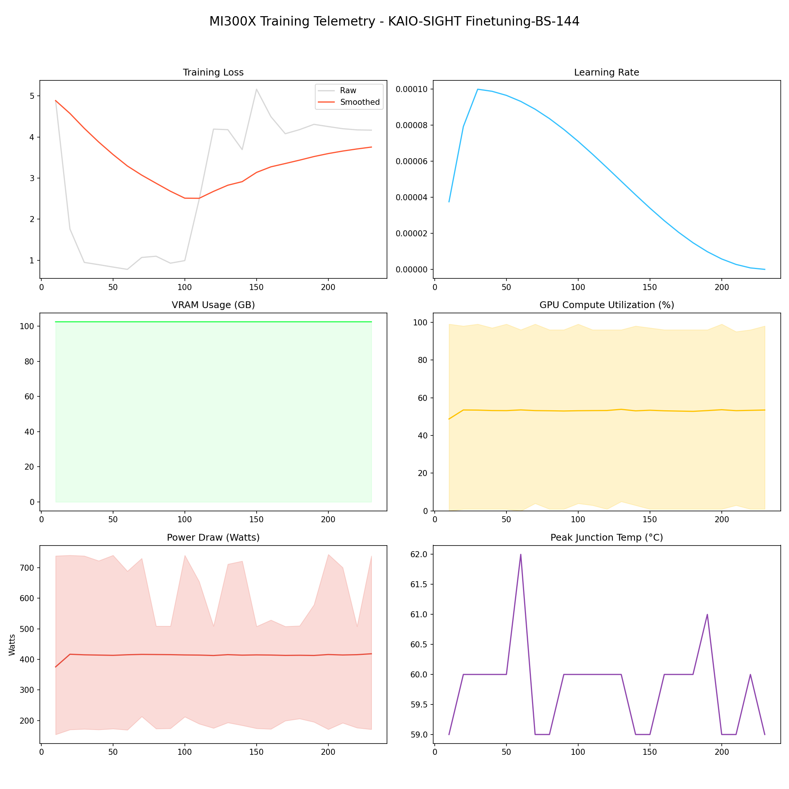

# 📑 Training Report — KAIO-SIGHT Finetuning-BS-144

**Status:** ✅ COMPLETED  
**Project:** `KAIO-SIGHT Finetuning-BS-144`  

## 📊 Executive Summary
**Duration:** 6.46 hours  
**Steps:** 230  
**Trainable Params:** 47,589,376 (0.57%)  
**Total Samples**:0

| Metric | Value |
|--------|-------|
| Samples Processed | 33,120 |
| **Initial Loss** | **4.8848** |
| **Final Loss** | **4.1661** |
| Peak VRAM | 102.45 GB |
| Avg VRAM | 102.44 GB |
| Avg GPU Utilization | 53.0 % |
| Avg Temp | 59.8 °C |
| **Peak Power** | **744.0 W** |
| Avg Power | 413.1 W |
| **Total Energy** | **2.6705 kWh** |

---

## 🖥️ MI300X Hardware Telemetry
> **Power Chart:** The shaded red region indicates the Min/Max fluctuation per step.



## ⚙️ Configuration Snapshot

| Hyperparameter | Value |
|----------------|-------|
| **Base Model** | `Qwen/Qwen2.5-VL-7B-Instruct` |
| **Precision** | `Bfloat16` |
| **Batch Size (Per GPU)** | `48` |
| **Grad Accumulation** | `3` |
| **Effective Batch Size** | `144` |
| **Learning Rate** | `0.0001` |
| **Optimizer** | `OptimizerNames.PAGED_ADAMW_8BIT` |

---

## 📝 Latest Logs
```json
[
  {
    "loss": 4.1725,
    "grad_norm": 20829546.0,
    "learning_rate": 8.269149183128988e-07,
    "epoch": 0.9551374819102749,
    "step": 220,
    "timestamp": "2025-12-30T01:05:12.811984",
    "vram_gb": 102.44259691238403,
    "power_avg": 415.42461122379984,
    "power_min": 176.0,
    "power_max": 508.0,
    "temp": 60.0,
    "util": 53.303583502366465,
    "util_min": 1.0,
    "util_max": 96.0
  },
  {
    "loss": 4.1661,
    "grad_norm": 23295186.0,
    "learning_rate": 2.3031684879742944e-08,
    "epoch": 0.9985528219971056,
    "step": 230,
    "timestamp": "2025-12-30T01:21:46.396192",
    "vram_gb": 102.44245195388794,
    "power_avg": 418.3957909029192,
    "power_min": 171.0,
    "power_max": 739.0,
    "temp": 59.0,
    "util": 53.47929395790903,
    "util_min": 1.0,
    "util_max": 98.0
  },
  {
    "train_runtime": 23270.6334,
    "train_samples_per_second": 1.425,
    "train_steps_per_second": 0.01,
    "total_flos": 4.188906450816897e+18,
    "train_loss": 2.949950891139703,
    "epoch": 1.0,
    "step": 231,
    "timestamp": "2025-12-30T01:23:28.425759",
    "vram_gb": 74.98768520355225,
    "power_avg": 292.9261363636364,
    "power_min": 172.0,
    "power_max": 498.0,
    "temp": 50.0,
    "util": 52.13068181818182,
    "util_min": 1.0,
    "util_max": 93.0
  }
]
```

## 🚀 HuggingFace Deployment
**Repo:** [Thunderbird2410/KAIO-SIGHT](https://huggingface.co/Thunderbird2410/KAIO-SIGHT)
**Commit:** `91dbf5834c14434dc9f9b4c8c2fa242d35ab66eb`
**Adapter Config:** [adapter_config.json](https://huggingface.co/Thunderbird2410/KAIO-SIGHT/blob/91dbf5834c14434dc9f9b4c8c2fa242d35ab66eb/adapter_config.json)
