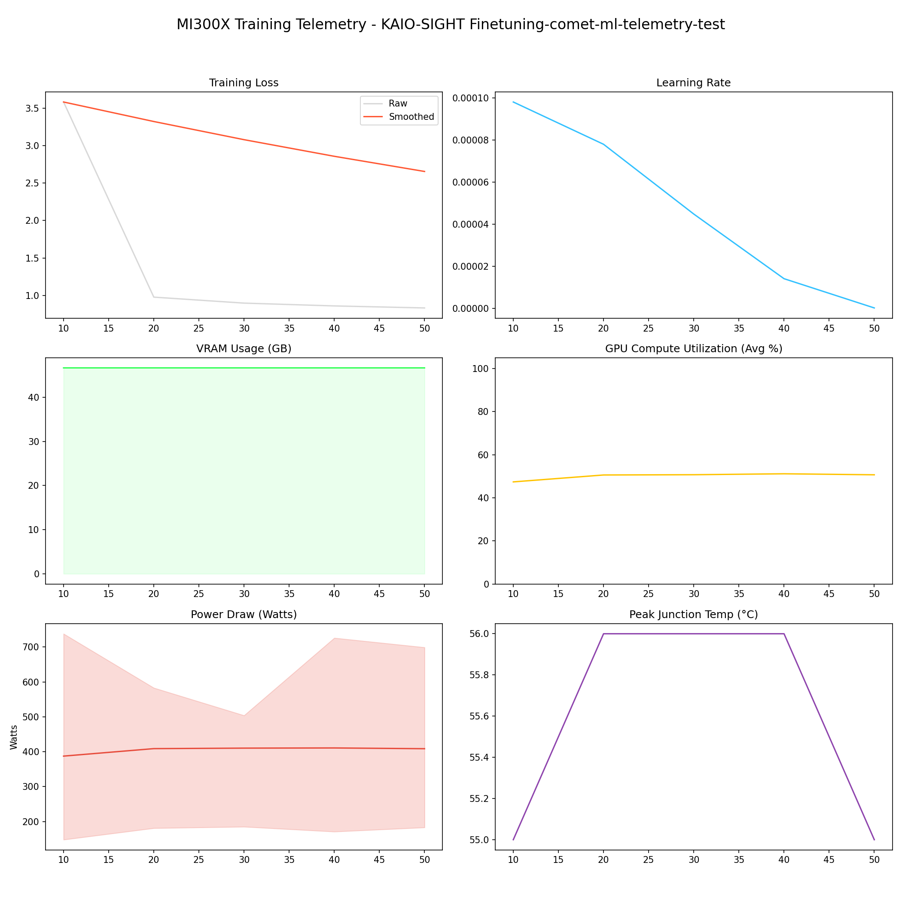

# 📑 Training Report — KAIO-SIGHT Finetuning-comet-ml-telemetry-test

**Status:** ✅ COMPLETED  
**Project:** `KAIO-SIGHT Finetuning-comet-ml-telemetry-test`  

## 📊 Executive Summary
**Duration:** 1.28 hours  
**Steps:** 50  
**Trainable Params:** 47,589,376 (0.57%)  
**Total Samples**:0

| Metric | Value |
|--------|-------|
| Samples Processed | 6,400 |
| **Initial Loss** | **3.5805** |
| **Final Loss** | **0.8344** |
| Peak VRAM | 46.63 GB |
| Avg VRAM | 46.63 GB |
| Avg GPU Utilization | 50.1 % |
| Avg Temp | 55.6 °C |
| **Peak Power** | **738.0 W** |
| Avg Power | 405.2 W |
| **Total Energy** | **0.5178 kWh** |

---

## 🖥️ MI300X Hardware Telemetry
> **Power Chart:** The shaded red region indicates the Min/Max fluctuation per step.



## ⚙️ Configuration Snapshot

| Hyperparameter | Value |
|----------------|-------|
| **Base Model** | `Qwen/Qwen2.5-VL-7B-Instruct` |
| **Precision** | `Bfloat16` |
| **Batch Size (Per GPU)** | `16` |
| **Grad Accumulation** | `8` |
| **Effective Batch Size** | `128` |
| **Learning Rate** | `0.0001` |
| **Optimizer** | `OptimizerNames.PAGED_ADAMW_8BIT` |

---

## 📝 Latest Logs
```json
[
  {
    "loss": 0.8614,
    "grad_norm": 2.1948182582855225,
    "learning_rate": 1.4033009983067452e-05,
    "epoch": 0.15436565364206464,
    "step": 40,
    "timestamp": "2025-12-29T16:12:30.382515",
    "vram_gb": 46.63332176208496,
    "power_avg": 410.83216783216784,
    "power_min": 171.0,
    "power_max": 726.0,
    "temp": 56.0,
    "util": 51.14141414141414
  },
  {
    "loss": 0.8344,
    "grad_norm": 2.38374662399292,
    "learning_rate": 1.2179748700879012e-07,
    "epoch": 0.1929570670525808,
    "step": 50,
    "timestamp": "2025-12-29T16:27:29.454954",
    "vram_gb": 46.63332176208496,
    "power_avg": 408.6703210649961,
    "power_min": 183.0,
    "power_max": 699.0,
    "temp": 55.0,
    "util": 50.66953797963978
  },
  {
    "train_runtime": 4597.779,
    "train_samples_per_second": 1.392,
    "train_steps_per_second": 0.011,
    "total_flos": 8.084135017829499e+17,
    "train_loss": 1.430709686279297,
    "epoch": 0.1929570670525808,
    "step": 50,
    "timestamp": "2025-12-29T16:27:33.215123",
    "vram_gb": 20.068915843963623,
    "power_avg": 0,
    "power_min": 0,
    "power_max": 0,
    "temp": 0,
    "util": 0
  }
]
```

## 🚀 HuggingFace Deployment
**Repo:** [Thunderbird2410/KAIO-SIGHT](https://huggingface.co/Thunderbird2410/KAIO-SIGHT)
**Commit:** `bc0b3c66c865427da4fc73b49bf9154f0829f597`
**Adapter Config:** [adapter_config.json](https://huggingface.co/Thunderbird2410/KAIO-SIGHT/blob/bc0b3c66c865427da4fc73b49bf9154f0829f597/adapter_config.json)
