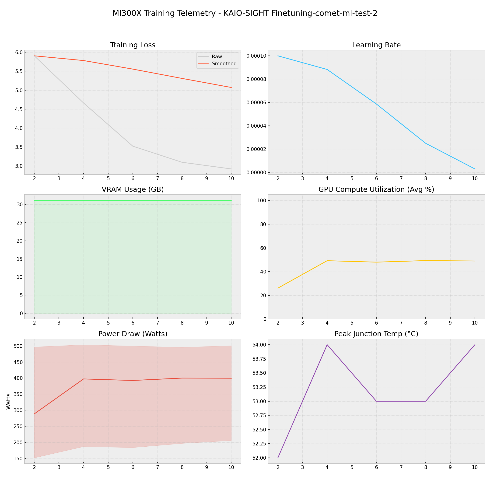

# 📑 Training Report — KAIO-SIGHT Finetuning-comet-ml-test-2

**Status:** ✅ COMPLETED  
**Project:** `KAIO-SIGHT Finetuning-comet-ml-test-2`  

## 📊 Executive Summary
**Duration:** 0.14 hours  
**Steps:** 10  
**Trainable Params:** 0 (0.00%)  
**Total Samples**:0

| Metric | Value |
|--------|-------|
| Samples Processed | 640 |
| **Initial Loss** | **5.9085** |
| **Final Loss** | **2.9191** |
| Peak VRAM | 31.15 GB |
| Avg VRAM | 31.15 GB |
| Avg GPU Utilization | 44.3 % |
| Avg Temp | 53.2 °C |
| **Peak Power** | **504.0 W** |
| Avg Power | 375.7 W |
| **Total Energy** | **0.0523 kWh** |

---

## 🖥️ MI300X Hardware Telemetry
> **Power Chart:** The shaded red region indicates the Min/Max fluctuation per step.



## ⚙️ Configuration Snapshot

| Hyperparameter | Value |
|----------------|-------|
| **Base Model** | `Unknown` |
| **Precision** | `Bfloat16` |
| **Batch Size (Per GPU)** | `8` |
| **Grad Accumulation** | `8` |
| **Effective Batch Size** | `64` |
| **Learning Rate** | `0.0001` |
| **Optimizer** | `OptimizerNames.PAGED_ADAMW_8BIT` |

---

## 📝 Latest Logs
```json
[
  {
    "loss": 3.095,
    "grad_norm": 4.092504024505615,
    "learning_rate": 2.500000000000001e-05,
    "epoch": 0.015440289505428226,
    "step": 8,
    "timestamp": "2025-12-29T12:16:11.165560",
    "vram_gb": 31.152445316314697,
    "power_avg": 400.05405405405406,
    "power_min": 197.0,
    "power_max": 496.0,
    "temp": 53.0,
    "util": 49.306306306306304
  },
  {
    "loss": 2.9191,
    "grad_norm": 3.9496042728424072,
    "learning_rate": 3.0153689607045845e-06,
    "epoch": 0.019300361881785282,
    "step": 10,
    "timestamp": "2025-12-29T12:17:37.066513",
    "vram_gb": 31.152552127838135,
    "power_avg": 399.6666666666667,
    "power_min": 206.0,
    "power_max": 501.0,
    "temp": 54.0,
    "util": 48.96396396396396
  },
  {
    "train_runtime": 498.5351,
    "train_samples_per_second": 1.284,
    "train_steps_per_second": 0.02,
    "total_flos": 8.0438088699691e+16,
    "train_loss": 4.021263456344604,
    "epoch": 0.019300361881785282,
    "step": 10,
    "timestamp": "2025-12-29T12:17:51.356174",
    "vram_gb": 17.911956310272217,
    "power_avg": 0,
    "power_min": 0,
    "power_max": 0,
    "temp": 0,
    "util": 0
  }
]
```