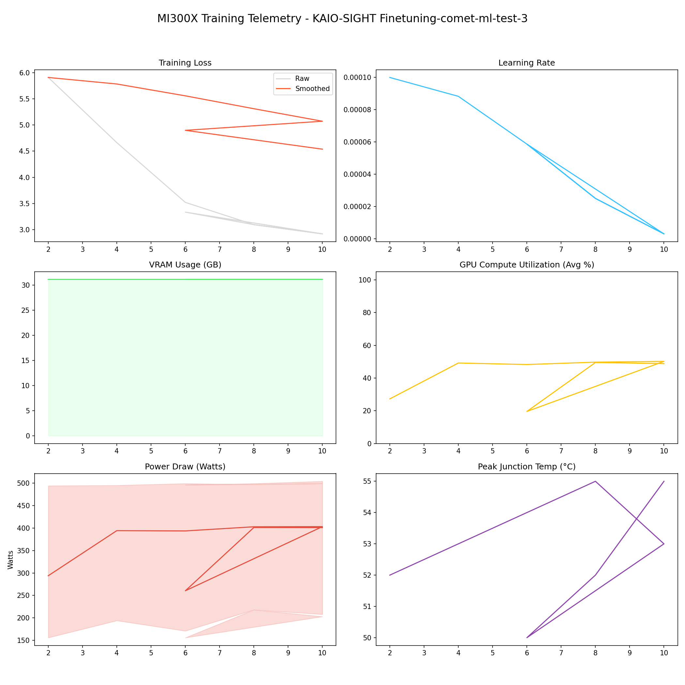

# 📑 Training Report — KAIO-SIGHT Finetuning-comet-ml-test-3

**Status:** ✅ COMPLETED  
**Project:** `KAIO-SIGHT Finetuning-comet-ml-test-3`  

## 📊 Executive Summary
**Duration:** 0.03 hours  
**Steps:** 10  
**Trainable Params:** 10,092,544 (0.12%)  
**Total Samples**:0

| Metric | Value |
|--------|-------|
| Samples Processed | 640 |
| **Initial Loss** | **5.9085** |
| **Final Loss** | **2.9191** |
| Peak VRAM | 31.15 GB |
| Avg VRAM | 31.15 GB |
| Avg GPU Utilization | 42.8 % |
| Avg Temp | 53.0 °C |
| **Peak Power** | **504.0 W** |
| Avg Power | 368.8 W |
| **Total Energy** | **0.0100 kWh** |

---

## 🖥️ MI300X Hardware Telemetry
> **Power Chart:** The shaded red region indicates the Min/Max fluctuation per step.



## ⚙️ Configuration Snapshot

| Hyperparameter | Value |
|----------------|-------|
| **Base Model** | `Qwen/Qwen2.5-VL-7B-Instruct` |
| **Precision** | `Bfloat16` |
| **Batch Size (Per GPU)** | `8` |
| **Grad Accumulation** | `8` |
| **Effective Batch Size** | `64` |
| **Learning Rate** | `0.0001` |
| **Optimizer** | `OptimizerNames.PAGED_ADAMW_8BIT` |

---

## 📝 Latest Logs
```json
[
  {
    "loss": 2.9191,
    "grad_norm": 3.9496042728424072,
    "learning_rate": 3.0153689607045845e-06,
    "epoch": 0.019300361881785282,
    "step": 10,
    "timestamp": "2025-12-29T12:55:36.482614",
    "vram_gb": 31.151779651641846,
    "power_avg": 400.94545454545454,
    "power_min": 208.0,
    "power_max": 504.0,
    "temp": 55.0,
    "util": 48.82727272727273
  },
  {
    "train_runtime": 262.8466,
    "train_samples_per_second": 2.435,
    "train_steps_per_second": 0.038,
    "total_flos": 8.0438088699691e+16,
    "train_loss": 1.53625648021698,
    "epoch": 0.019300361881785282,
    "step": 10,
    "timestamp": "2025-12-29T12:55:37.334807",
    "vram_gb": 17.911588191986084,
    "power_avg": 0,
    "power_min": 0,
    "power_max": 0,
    "temp": 0,
    "util": 0
  },
  {
    "train_runtime": 92.4059,
    "train_samples_per_second": 2.078,
    "train_steps_per_second": 0.032,
    "total_flos": 8.848044541024666e+16,
    "train_loss": 0.24037532372908157,
    "epoch": 0.021230398069963814,
    "step": 11,
    "timestamp": "2025-12-29T12:59:36.198416",
    "vram_gb": 31.15161895751953,
    "power_avg": 257.2589928057554,
    "power_min": 149.0,
    "power_max": 498.0,
    "temp": 48.0,
    "util": 19.575539568345324
  }
]
```