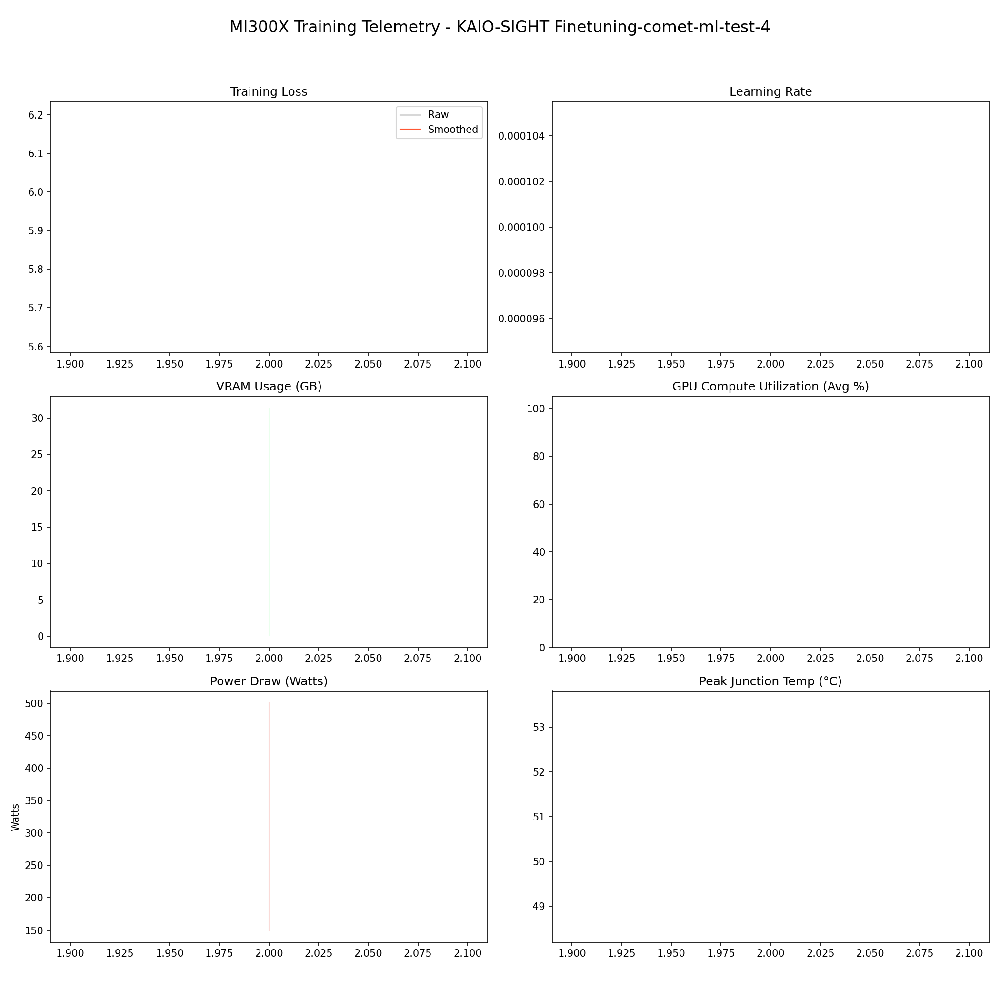

# 📑 Training Report — KAIO-SIGHT Finetuning-comet-ml-test-4

**Status:** ✅ COMPLETED  
**Project:** `KAIO-SIGHT Finetuning-comet-ml-test-4`  

## 📊 Executive Summary
**Duration:** 0.06 hours  
**Steps:** 2  
**Trainable Params:** 47,589,376 (0.57%)  
**Total Samples**:0

| Metric | Value |
|--------|-------|
| Samples Processed | 128 |
| **Initial Loss** | **5.9085** |
| **Final Loss** | **5.9085** |
| Peak VRAM | 31.42 GB |
| Avg VRAM | 31.42 GB |
| Avg GPU Utilization | 30.6 % |
| Avg Temp | 51.0 °C |
| **Peak Power** | **501.0 W** |
| Avg Power | 313.9 W |
| **Total Energy** | **0.0176 kWh** |

---

## 🖥️ MI300X Hardware Telemetry
> **Power Chart:** The shaded red region indicates the Min/Max fluctuation per step.



## ⚙️ Configuration Snapshot

| Hyperparameter | Value |
|----------------|-------|
| **Base Model** | `Qwen/Qwen2.5-VL-7B-Instruct` |
| **Precision** | `Bfloat16` |
| **Batch Size (Per GPU)** | `8` |
| **Grad Accumulation** | `8` |
| **Effective Batch Size** | `64` |
| **Learning Rate** | `0.0001` |
| **Optimizer** | `OptimizerNames.PAGED_ADAMW_8BIT` |

---

## 📝 Latest Logs
```json
[
  {
    "loss": 5.9085,
    "grad_norm": 37.996158599853516,
    "learning_rate": 0.0001,
    "epoch": 0.0038600723763570566,
    "step": 2,
    "timestamp": "2025-12-29T13:20:08.672173",
    "vram_gb": 31.418657779693604,
    "power_avg": 313.93506493506493,
    "power_min": 149.0,
    "power_max": 501.0,
    "temp": 51.0,
    "util": 30.571428571428573
  },
  {
    "train_runtime": 197.8168,
    "train_samples_per_second": 0.971,
    "train_steps_per_second": 0.015,
    "total_flos": 2.4247810510946304e+16,
    "train_loss": 5.282933235168457,
    "epoch": 0.005790108564535585,
    "step": 3,
    "timestamp": "2025-12-29T13:20:55.697264",
    "vram_gb": 31.426180362701416,
    "power_avg": 415.14925373134326,
    "power_min": 212.0,
    "power_max": 503.0,
    "temp": 53.0,
    "util": 49.6865671641791
  }
]
```