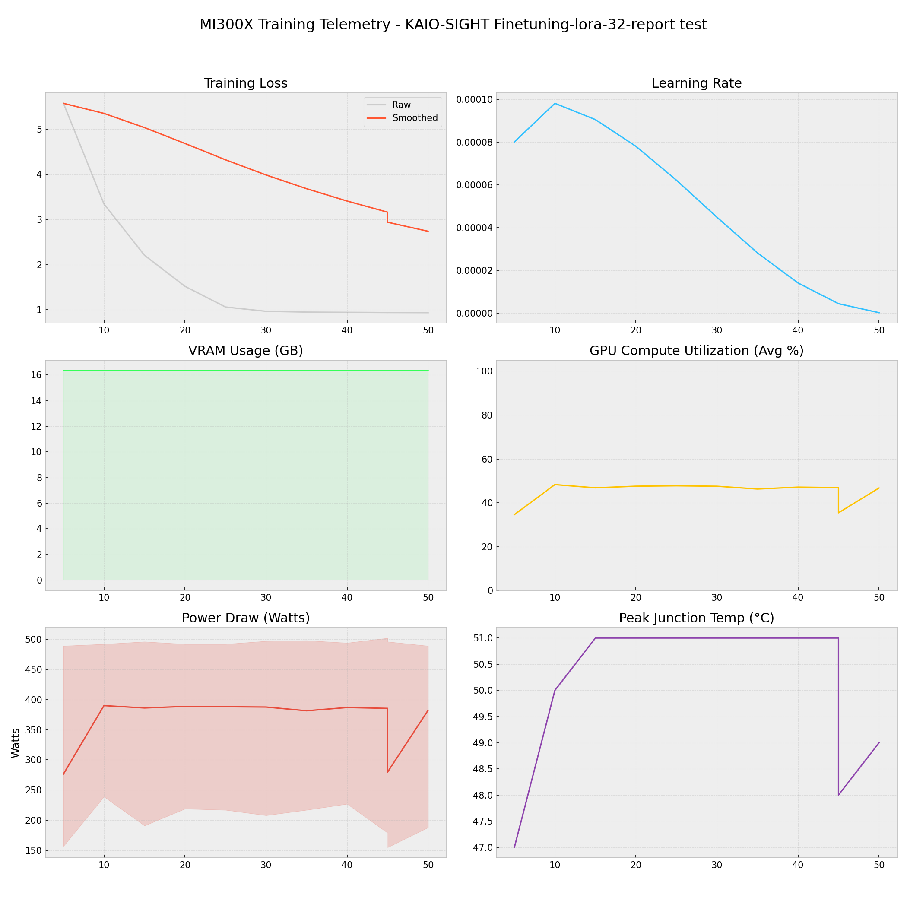

# 📑 Training Report — KAIO-SIGHT Finetuning-lora-32-report test

**Status:** ✅ COMPLETED  
**Project:** `KAIO-SIGHT Finetuning-lora-32-report test`  

## 📊 Executive Summary
**Duration:** 0.05 hours  
**Steps:** 50  
**Trainable Params:** 10,092,544 (0.12%)  
**Total Samples**:0

| Metric | Value |
|--------|-------|
| Samples Processed | 3,200 |
| **Initial Loss** | **5.5743** |
| **Final Loss** | **0.9374** |
| Peak VRAM | 16.34 GB |
| Avg VRAM | 16.34 GB |
| Avg GPU Utilization | 45.0 % |
| Avg Temp | 50.1 °C |
| **Peak Power** | **502.0 W** |
| Avg Power | 366.6 W |
| **Total Energy** | **0.0170 kWh** |

---

## 🖥️ MI300X Hardware Telemetry
> **Power Chart:** The shaded red region indicates the Min/Max fluctuation per step.



## ⚙️ Configuration Snapshot

| Hyperparameter | Value |
|----------------|-------|
| **Base Model** | `Qwen2_5_VLForConditionalGeneration` |
| **Precision** | `Bfloat16` |
| **Batch Size (Per GPU)** | `8` |
| **Grad Accumulation** | `8` |
| **Effective Batch Size** | `64` |
| **Learning Rate** | `0.0001` |
| **Optimizer** | `OptimizerNames.PAGED_ADAMW_8BIT` |

---

## 📝 Latest Logs
```json
[
  {
    "loss": 0.9404,
    "grad_norm": 0.4102211594581604,
    "learning_rate": 4.322727117869951e-06,
    "epoch": 0.08685162846803378,
    "step": 45,
    "timestamp": "2025-12-29T09:17:14.143981",
    "vram_gb": 16.34201431274414,
    "power_avg": 279.87951807228916,
    "power_min": 155.0,
    "power_max": 496.0,
    "temp": 48.0,
    "util": 35.43478260869565
  },
  {
    "loss": 0.9374,
    "grad_norm": 0.2644215524196625,
    "learning_rate": 1.2179748700879012e-07,
    "epoch": 0.09650180940892641,
    "step": 50,
    "timestamp": "2025-12-29T09:18:12.770684",
    "vram_gb": 16.34213638305664,
    "power_avg": 382.30232558139534,
    "power_min": 188.0,
    "power_max": 489.0,
    "temp": 49.0,
    "util": 46.73255813953488
  },
  {
    "train_runtime": 163.781,
    "train_samples_per_second": 19.538,
    "train_steps_per_second": 0.305,
    "total_flos": 1.1263022880453427e+17,
    "train_loss": 0.1877864646911621,
    "epoch": 0.09650180940892641,
    "step": 50,
    "timestamp": "2025-12-29T09:18:13.377274",
    "vram_gb": 16.34213638305664,
    "power_avg": 216.0,
    "power_min": 216.0,
    "power_max": 216.0,
    "temp": 47.0,
    "util": 7.0
  }
]
```