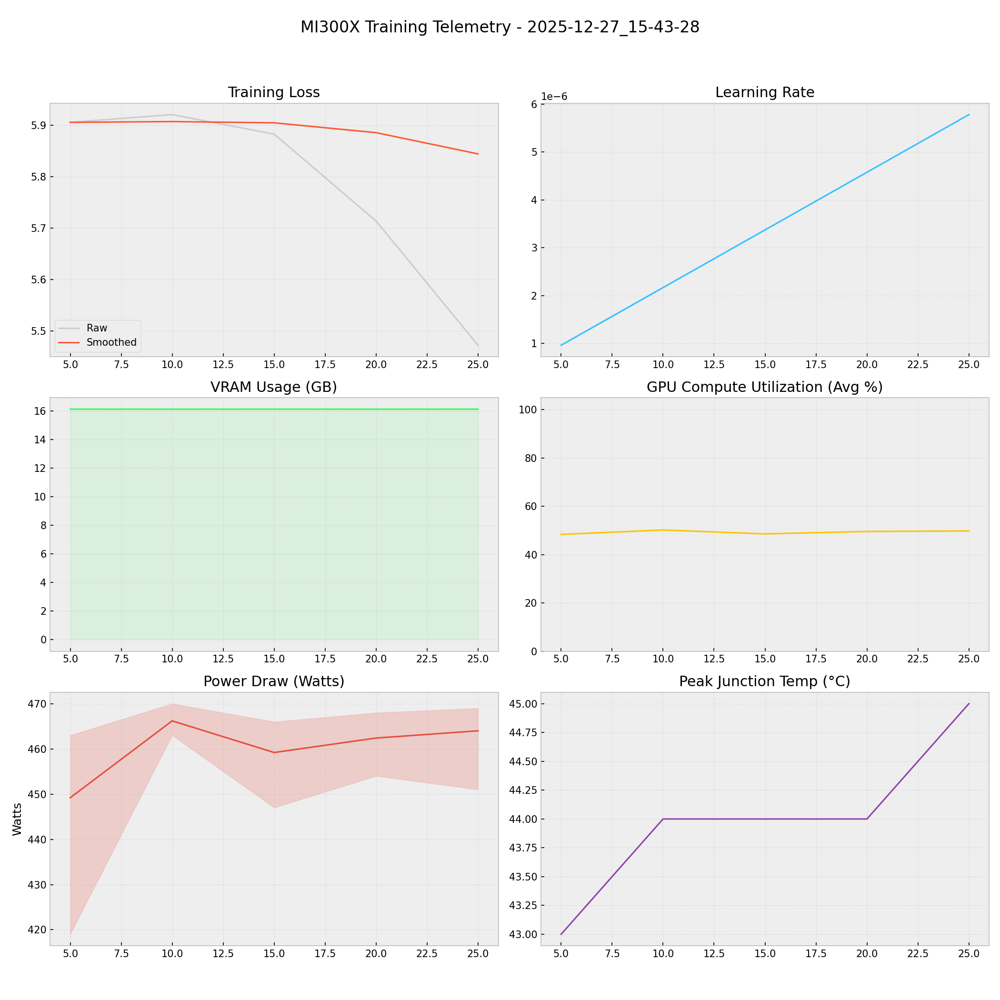

# 📑 Training Report — 2025-12-27_15-43-28

**Status:** 🔄 RUNNING  
**Project:** `docs`  

## 📊 Executive Summary
**Duration:** 0.08 hours  
**Steps:** 25  
**Trainable Params:** 10,092,544 (0.12%)  
**Total Examples:** 0  

| Metric | Value |
|--------|-------|
| Samples Processed | 200 |
| **Initial Loss** | **5.9054** |
| **Final Loss** | **5.4721** |
| Peak VRAM | 16.14 GB |
| Avg VRAM | 16.14 GB |
| Avg GPU Utilization | 49.3 % |
| Avg Temp | 44.0 °C |
| **Peak Power** | **470.0 W** |
| Avg Power | 460.2 W |
| **Total Energy** | **0.0388 kWh** |

---

## 🖥️ MI300X Hardware Telemetry
> **Power Chart:** The shaded red region indicates the Min/Max fluctuation per step.



## ⚙️ Configuration Snapshot

| Hyperparameter | Value |
|----------------|-------|
| **Base Model** | `Qwen2_5_VLForConditionalGeneration` |
| **Precision** | `Bfloat16` |
| **Batch Size (Per GPU)** | `1` |
| **Grad Accumulation** | `8` |
| **Effective Batch Size** | `8` |
| **Learning Rate** | `0.0001` |
| **Optimizer** | `OptimizerNames.PAGED_ADAMW_8BIT` |

---

## 📝 Latest Logs
```json
[
  {
    "loss": 5.8825,
    "grad_norm": 13.046425819396973,
    "learning_rate": 3.3734939759036146e-06,
    "epoch": 0.003619581938286128,
    "step": 15,
    "timestamp": "2025-12-27T15:46:41.107849",
    "vram_gb": 16.139089584350586,
    "power_avg": 459.2,
    "power_min": 447.0,
    "power_max": 466.0,
    "temp": 44.0,
    "util": 48.6
  },
  {
    "loss": 5.7136,
    "grad_norm": 13.449252128601074,
    "learning_rate": 4.578313253012049e-06,
    "epoch": 0.00482610925104817,
    "step": 20,
    "timestamp": "2025-12-27T15:47:35.411645",
    "vram_gb": 16.137075424194336,
    "power_avg": 462.4,
    "power_min": 454.0,
    "power_max": 468.0,
    "temp": 44.0,
    "util": 49.6
  },
  {
    "loss": 5.4721,
    "grad_norm": 12.17174243927002,
    "learning_rate": 5.783132530120483e-06,
    "epoch": 0.006032636563810213,
    "step": 25,
    "timestamp": "2025-12-27T15:48:31.019649",
    "vram_gb": 16.139089584350586,
    "power_avg": 464.0,
    "power_min": 451.0,
    "power_max": 469.0,
    "temp": 45.0,
    "util": 49.8
  }
]
```