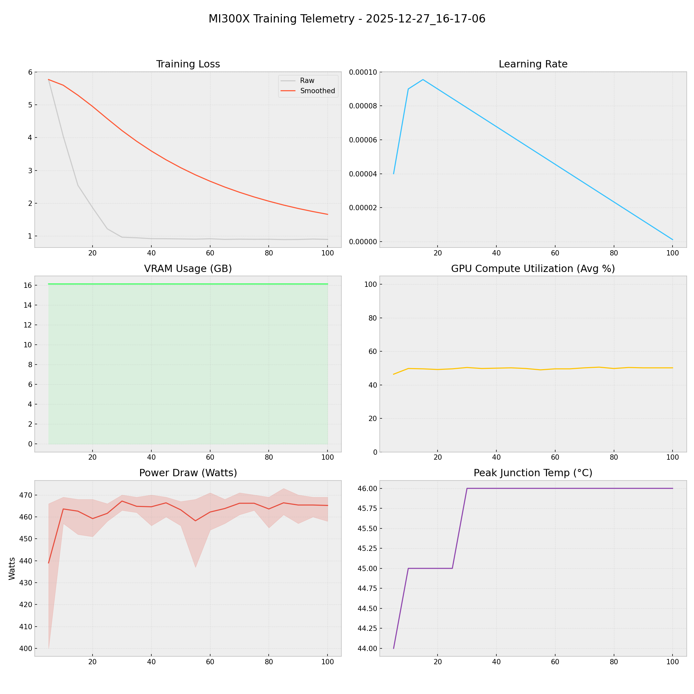

# 📑 Training Report — 2025-12-27_16-17-06

**Status:** ✅ COMPLETED  
**Project:** `docs`  

## 📊 Executive Summary
**Duration:** 0.30 hours  
**Steps:** 100  
**Trainable Params:** 10,092,544 (0.12%)  
**Total Examples:** 0  

| Metric | Value |
|--------|-------|
| Samples Processed | 800 |
| **Initial Loss** | **5.7688** |
| **Final Loss** | **0.8985** |
| Peak VRAM | 16.14 GB |
| Avg VRAM | 16.14 GB |
| Avg GPU Utilization | 49.7 % |
| Avg Temp | 45.7 °C |
| **Peak Power** | **473.0 W** |
| Avg Power | 462.7 W |
| **Total Energy** | **0.1372 kWh** |

---

## 🖥️ MI300X Hardware Telemetry
> **Power Chart:** The shaded red region indicates the Min/Max fluctuation per step.



## ⚙️ Configuration Snapshot

| Hyperparameter | Value |
|----------------|-------|
| **Base Model** | `Qwen2_5_VLForConditionalGeneration` |
| **Precision** | `Bfloat16` |
| **Batch Size (Per GPU)** | `1` |
| **Grad Accumulation** | `8` |
| **Effective Batch Size** | `8` |
| **Learning Rate** | `0.0001` |
| **Optimizer** | `OptimizerNames.PAGED_ADAMW_8BIT` |

---

## 📝 Latest Logs
```json
[
  {
    "loss": 0.9102,
    "grad_norm": 0.9193482995033264,
    "learning_rate": 6.666666666666667e-06,
    "epoch": 0.02292401894247881,
    "step": 95,
    "timestamp": "2025-12-27T16:34:01.987825",
    "vram_gb": 16.139089584350586,
    "power_avg": 465.4,
    "power_min": 460.0,
    "power_max": 469.0,
    "temp": 46.0,
    "util": 50.2
  },
  {
    "loss": 0.8985,
    "grad_norm": 0.9864808917045593,
    "learning_rate": 1.1111111111111112e-06,
    "epoch": 0.024130546255240852,
    "step": 100,
    "timestamp": "2025-12-27T16:34:52.211652",
    "vram_gb": 16.137075424194336,
    "power_avg": 465.2,
    "power_min": 458.0,
    "power_max": 469.0,
    "temp": 46.0,
    "util": 50.2
  },
  {
    "train_runtime": 1065.2751,
    "train_samples_per_second": 0.751,
    "train_steps_per_second": 0.094,
    "total_flos": 1.00441026097152e+17,
    "train_loss": 1.4573199892044066,
    "epoch": 0.024130546255240852,
    "step": 100,
    "timestamp": "2025-12-27T16:34:53.489456",
    "vram_gb": 16.137075424194336,
    "power_avg": 0,
    "power_min": 0,
    "power_max": 0,
    "temp": 0,
    "util": 0
  }
]
```