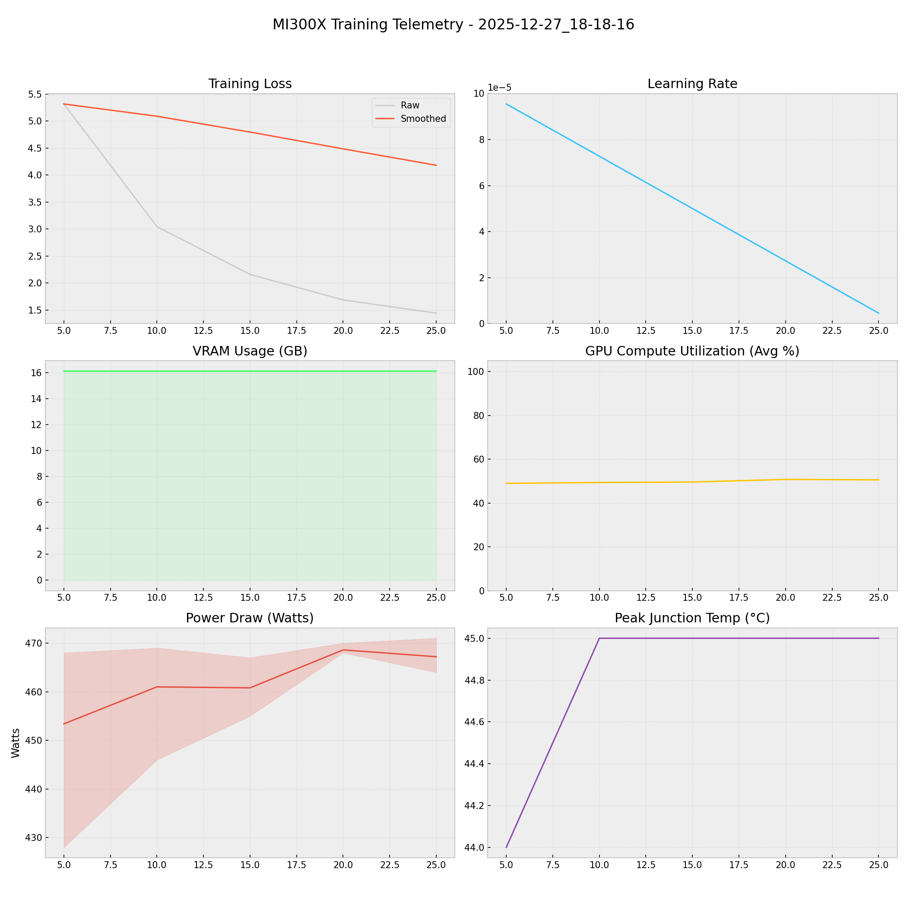

# 📑 Training Report — 2025-12-27_18-18-16

**Status:** ✅ COMPLETED  
**Project:** `docs`  

## 📊 Executive Summary
**Duration:** 0.08 hours  
**Steps:** 25  
**Trainable Params:** 10,092,544 (0.12%)  
**Total Examples:** 0  

| Metric | Value |
|--------|-------|
| Samples Processed | 200 |
| **Initial Loss** | **5.3175** |
| **Final Loss** | **1.4400** |
| Peak VRAM | 16.14 GB |
| Avg VRAM | 16.14 GB |
| Avg GPU Utilization | 49.9 % |
| Avg Temp | 44.8 °C |
| **Peak Power** | **471.0 W** |
| Avg Power | 462.2 W |
| **Total Energy** | **0.0389 kWh** |

---

## 🖥️ MI300X Hardware Telemetry
> **Power Chart:** The shaded red region indicates the Min/Max fluctuation per step.



## ⚙️ Configuration Snapshot

| Hyperparameter | Value |
|----------------|-------|
| **Base Model** | `Qwen2_5_VLForConditionalGeneration` |
| **Precision** | `Bfloat16` |
| **Batch Size (Per GPU)** | `1` |
| **Grad Accumulation** | `8` |
| **Effective Batch Size** | `8` |
| **Learning Rate** | `0.0001` |
| **Optimizer** | `OptimizerNames.PAGED_ADAMW_8BIT` |

---

## 📝 Latest Logs
```json
[
  {
    "loss": 1.6849,
    "grad_norm": 3.6839044094085693,
    "learning_rate": 2.7272727272727273e-05,
    "epoch": 0.00482610925104817,
    "step": 20,
    "timestamp": "2025-12-27T18:22:22.995772",
    "vram_gb": 16.137075424194336,
    "power_avg": 468.6,
    "power_min": 468.0,
    "power_max": 470.0,
    "temp": 45.0,
    "util": 50.8
  },
  {
    "loss": 1.44,
    "grad_norm": 3.304551362991333,
    "learning_rate": 4.5454545454545455e-06,
    "epoch": 0.006032636563810213,
    "step": 25,
    "timestamp": "2025-12-27T18:23:18.035843",
    "vram_gb": 16.139089584350586,
    "power_avg": 467.2,
    "power_min": 464.0,
    "power_max": 471.0,
    "temp": 45.0,
    "util": 50.6
  },
  {
    "train_runtime": 300.416,
    "train_samples_per_second": 0.666,
    "train_steps_per_second": 0.083,
    "total_flos": 2.511104776499405e+16,
    "train_loss": 2.728799591064453,
    "epoch": 0.006032636563810213,
    "step": 25,
    "timestamp": "2025-12-27T18:23:19.146246",
    "vram_gb": 16.139089584350586,
    "power_avg": 0,
    "power_min": 0,
    "power_max": 0,
    "temp": 0,
    "util": 0
  }
]
```

## 🚀 HuggingFace Deployment
**Repo:** [Thunderbird2410/KAIO-SIGHT](https://huggingface.co/Thunderbird2410/KAIO-SIGHT)
**Commit:** `2f02e5656a29074fa671bbc561b0ac54a4437e6b`
**Adapter Config:** [adapter_config.json](https://huggingface.co/Thunderbird2410/KAIO-SIGHT/blob/2f02e5656a29074fa671bbc561b0ac54a4437e6b/adapter_config.json)
