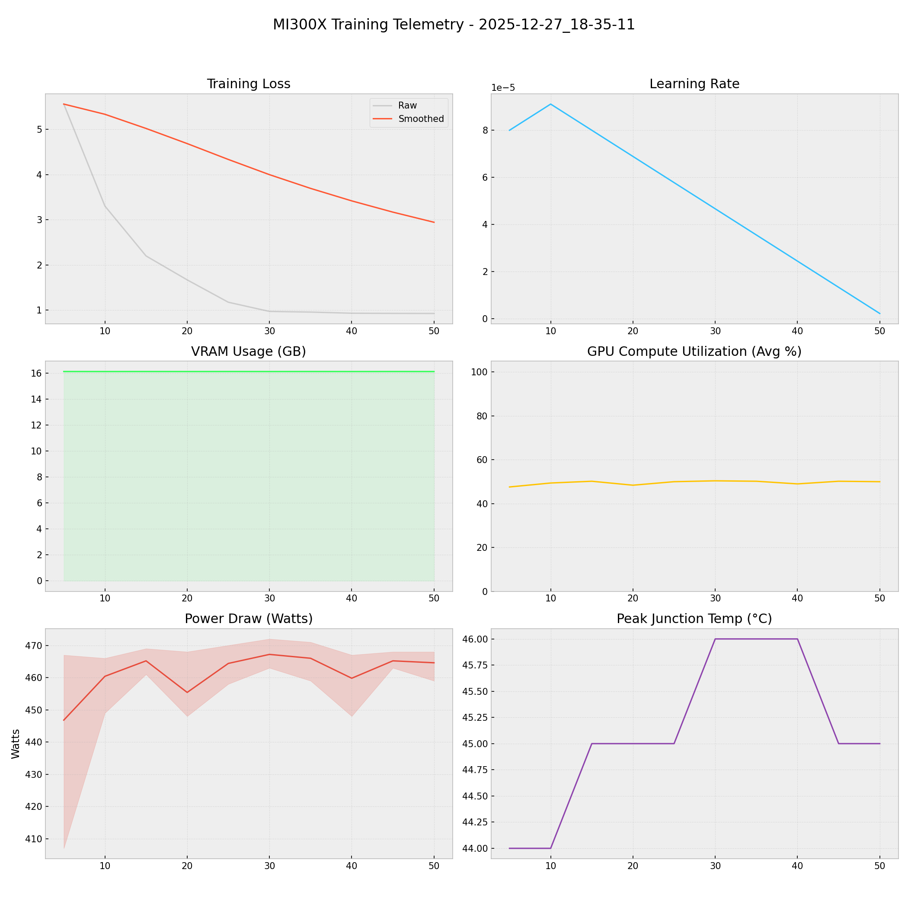

# 📑 Training Report — 2025-12-27_18-35-11

**Status:** ✅ COMPLETED  
**Project:** `docs`  

## 📊 Executive Summary
**Duration:** 0.16 hours  
**Steps:** 50  
**Trainable Params:** 10,092,544 (0.12%)  
**Total Examples:** 0  

| Metric | Value |
|--------|-------|
| Samples Processed | 400 |
| **Initial Loss** | **5.5605** |
| **Final Loss** | **0.9257** |
| Peak VRAM | 16.14 GB |
| Avg VRAM | 16.14 GB |
| Avg GPU Utilization | 49.5 % |
| Avg Temp | 45.1 °C |
| **Peak Power** | **472.0 W** |
| Avg Power | 461.5 W |
| **Total Energy** | **0.0730 kWh** |

---

## 🖥️ MI300X Hardware Telemetry
> **Power Chart:** The shaded red region indicates the Min/Max fluctuation per step.



## ⚙️ Configuration Snapshot

| Hyperparameter | Value |
|----------------|-------|
| **Base Model** | `Qwen2_5_VLForConditionalGeneration` |
| **Precision** | `Bfloat16` |
| **Batch Size (Per GPU)** | `1` |
| **Grad Accumulation** | `8` |
| **Effective Batch Size** | `8` |
| **Learning Rate** | `0.0001` |
| **Optimizer** | `OptimizerNames.PAGED_ADAMW_8BIT` |

---

## 📝 Latest Logs
```json
[
  {
    "loss": 0.9277,
    "grad_norm": 0.8390419483184814,
    "learning_rate": 1.3333333333333333e-05,
    "epoch": 0.010858745814858383,
    "step": 45,
    "timestamp": "2025-12-27T18:43:42.851693",
    "vram_gb": 16.139089584350586,
    "power_avg": 465.2,
    "power_min": 463.0,
    "power_max": 468.0,
    "temp": 45.0,
    "util": 50.2
  },
  {
    "loss": 0.9257,
    "grad_norm": 0.8396579027175903,
    "learning_rate": 2.2222222222222225e-06,
    "epoch": 0.012065273127620426,
    "step": 50,
    "timestamp": "2025-12-27T18:44:39.619844",
    "vram_gb": 16.137075424194336,
    "power_avg": 464.6,
    "power_min": 459.0,
    "power_max": 468.0,
    "temp": 45.0,
    "util": 50.0
  },
  {
    "train_runtime": 566.9767,
    "train_samples_per_second": 0.705,
    "train_steps_per_second": 0.088,
    "total_flos": 5.02212577457111e+16,
    "train_loss": 1.861869411468506,
    "epoch": 0.012065273127620426,
    "step": 50,
    "timestamp": "2025-12-27T18:44:40.693692",
    "vram_gb": 16.137075424194336,
    "power_avg": 0,
    "power_min": 0,
    "power_max": 0,
    "temp": 0,
    "util": 0
  }
]
```

## 🚀 HuggingFace Deployment
**Repo:** [Thunderbird2410/KAIO-SIGHT](https://huggingface.co/Thunderbird2410/KAIO-SIGHT)
**Commit:** `435ddfe3a14f605d1c0915b71b67156dea15a618`
**Adapter Config:** [adapter_config.json](https://huggingface.co/Thunderbird2410/KAIO-SIGHT/blob/435ddfe3a14f605d1c0915b71b67156dea15a618/adapter_config.json)
