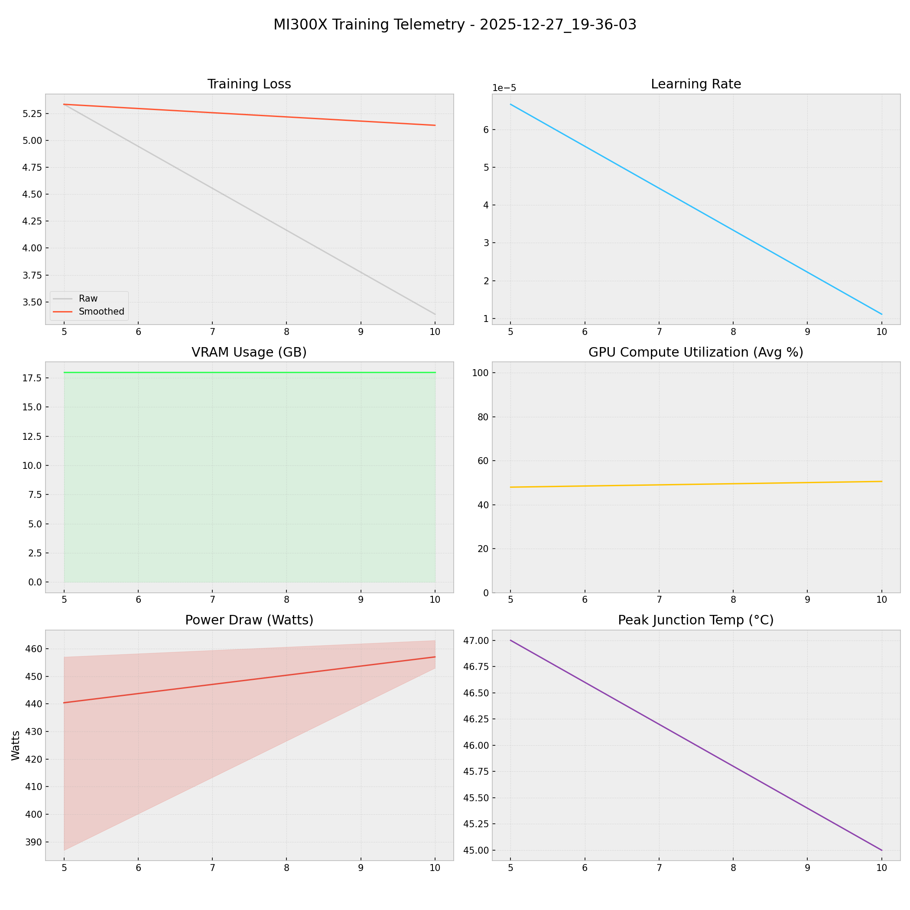

# 📑 Training Report — 2025-12-27_19-36-03

**Status:** ✅ COMPLETED  
**Project:** `docs`  

## 📊 Executive Summary
**Duration:** 0.18 hours  
**Steps:** 10  
**Trainable Params:** 10,092,544 (0.12%)  
**Total Samples**:0

| Metric | Value |
|--------|-------|
| Samples Processed | 160 |
| **Initial Loss** | **5.3367** |
| **Final Loss** | **3.3856** |
| Peak VRAM | 17.97 GB |
| Avg VRAM | 17.97 GB |
| Avg GPU Utilization | 49.3 % |
| Avg Temp | 46.0 °C |
| **Peak Power** | **463.0 W** |
| Avg Power | 448.7 W |
| **Total Energy** | **0.0804 kWh** |

---

## 🖥️ MI300X Hardware Telemetry
> **Power Chart:** The shaded red region indicates the Min/Max fluctuation per step.



## ⚙️ Configuration Snapshot

| Hyperparameter | Value |
|----------------|-------|
| **Base Model** | `Qwen2_5_VLForConditionalGeneration` |
| **Precision** | `Bfloat16` |
| **Batch Size (Per GPU)** | `8` |
| **Grad Accumulation** | `2` |
| **Effective Batch Size** | `16` |
| **Learning Rate** | `0.0001` |
| **Optimizer** | `OptimizerNames.PAGED_ADAMW_8BIT` |

---

## 📝 Latest Logs
```json
[
  {
    "loss": 5.3367,
    "grad_norm": 9.54304027557373,
    "learning_rate": 6.666666666666667e-05,
    "epoch": 0.0024125452352231603,
    "step": 5,
    "timestamp": "2025-12-27T19:42:23.068044",
    "vram_gb": 17.970714569091797,
    "power_avg": 440.4,
    "power_min": 387.0,
    "power_max": 457.0,
    "temp": 47.0,
    "util": 48.0
  },
  {
    "loss": 3.3856,
    "grad_norm": 6.254161834716797,
    "learning_rate": 1.1111111111111112e-05,
    "epoch": 0.0048250904704463205,
    "step": 10,
    "timestamp": "2025-12-27T19:46:46.676076",
    "vram_gb": 17.970714569091797,
    "power_avg": 457.0,
    "power_min": 453.0,
    "power_max": 463.0,
    "temp": 45.0,
    "util": 50.6
  },
  {
    "train_runtime": 642.2711,
    "train_samples_per_second": 0.249,
    "train_steps_per_second": 0.016,
    "total_flos": 7.801856770773811e+16,
    "train_loss": 4.36112003326416,
    "epoch": 0.0048250904704463205,
    "step": 10,
    "timestamp": "2025-12-27T19:46:47.471538",
    "vram_gb": 17.970714569091797,
    "power_avg": 0,
    "power_min": 0,
    "power_max": 0,
    "temp": 0,
    "util": 0
  }
]
```

## 🚀 HuggingFace Deployment
**Repo:** [Thunderbird2410/KAIO-SIGHT](https://huggingface.co/Thunderbird2410/KAIO-SIGHT)
**Commit:** `8bb902fc9fffcc5215b8aa7677b461be0c97adc3`
**Adapter Config:** [adapter_config.json](https://huggingface.co/Thunderbird2410/KAIO-SIGHT/blob/8bb902fc9fffcc5215b8aa7677b461be0c97adc3/adapter_config.json)
