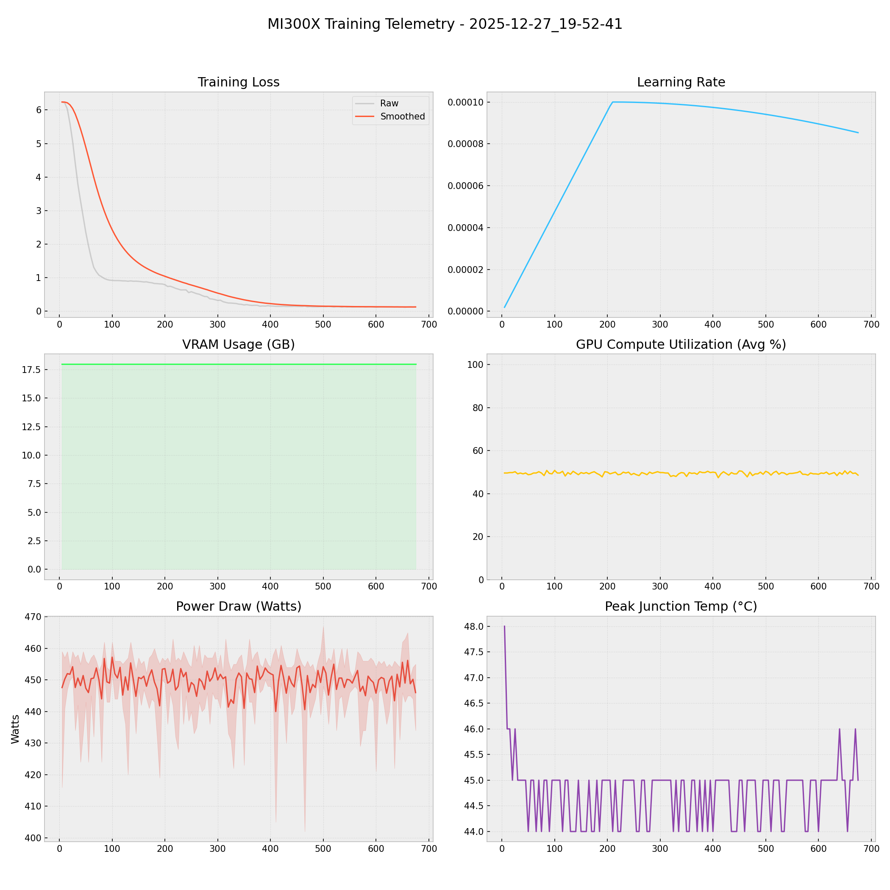

# 📑 Training Report — 2025-12-27_19-52-41

**Status:** 🔄 RUNNING  
**Project:** `docs`  

## 📊 Executive Summary
**Duration:** 9.57 hours  
**Steps:** 650  
**Trainable Params:** 10,092,544 (0.12%)  
**Total Samples**:0

| Metric | Value |
|--------|-------|
| Samples Processed | 10,400 |
| **Initial Loss** | **6.2374** |
| **Final Loss** | **0.1241** |
| Peak VRAM | 17.97 GB |
| Avg VRAM | 17.97 GB |
| Avg GPU Utilization | 49.4 % |
| Avg Temp | 44.7 °C |
| **Peak Power** | **467.0 W** |
| Avg Power | 449.7 W |
| **Total Energy** | **4.3022 kWh** |

---

## 🖥️ MI300X Hardware Telemetry
> **Power Chart:** The shaded red region indicates the Min/Max fluctuation per step.



## ⚙️ Configuration Snapshot

| Hyperparameter | Value |
|----------------|-------|
| **Base Model** | `Qwen2_5_VLForConditionalGeneration` |
| **Precision** | `Bfloat16` |
| **Batch Size (Per GPU)** | `8` |
| **Grad Accumulation** | `2` |
| **Effective Batch Size** | `16` |
| **Learning Rate** | `0.0001` |
| **Optimizer** | `OptimizerNames.PAGED_ADAMW_8BIT` |

---

## 📝 Latest Logs
```json
[
  {
    "loss": 0.1286,
    "grad_norm": 2.594388961791992,
    "learning_rate": 8.739114714735202e-05,
    "epoch": 0.3088057901085645,
    "step": 640,
    "timestamp": "2025-12-28T05:17:51.747974",
    "vram_gb": 17.970714569091797,
    "power_avg": 451.8,
    "power_min": 449.0,
    "power_max": 455.0,
    "temp": 46.0,
    "util": 49.8
  },
  {
    "loss": 0.1225,
    "grad_norm": 0.7178722023963928,
    "learning_rate": 8.711024007313312e-05,
    "epoch": 0.3112183353437877,
    "step": 645,
    "timestamp": "2025-12-28T05:22:15.723980",
    "vram_gb": 17.970714569091797,
    "power_avg": 447.8,
    "power_min": 431.0,
    "power_max": 454.0,
    "temp": 45.0,
    "util": 49.0
  },
  {
    "loss": 0.1241,
    "grad_norm": 1.4060816764831543,
    "learning_rate": 8.682670046922181e-05,
    "epoch": 0.31363088057901084,
    "step": 650,
    "timestamp": "2025-12-28T05:26:39.611840",
    "vram_gb": 17.970714569091797,
    "power_avg": 455.6,
    "power_min": 446.0,
    "power_max": 462.0,
    "temp": 45.0,
    "util": 50.6
  }
]
```