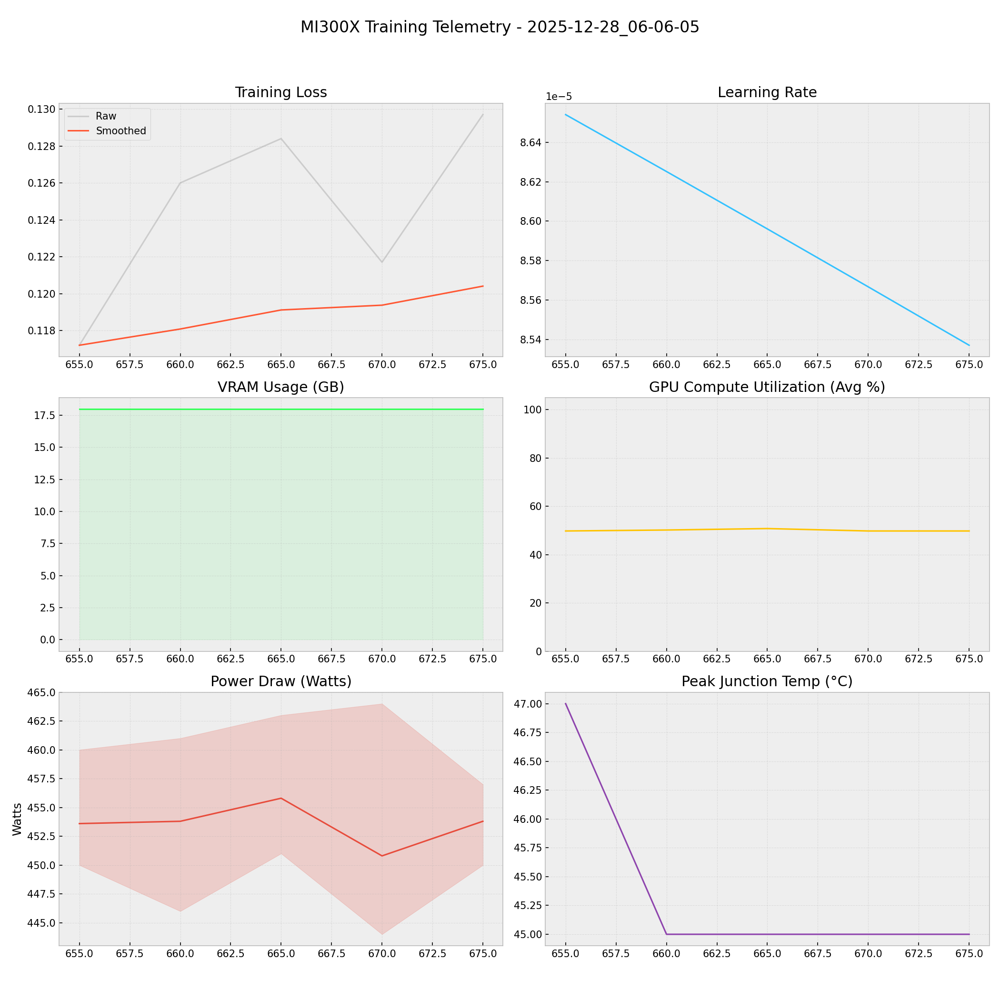

# 📑 Training Report — 2025-12-28_06-06-05

**Status:** 🔄 RUNNING  
**Project:** `docs`  

## 📊 Executive Summary
**Duration:** 0.38 hours  
**Steps:** 675  
**Trainable Params:** 10,092,544 (0.12%)  
**Total Samples**:0

| Metric | Value |
|--------|-------|
| Samples Processed | 10,800 |
| **Initial Loss** | **0.1172** |
| **Final Loss** | **0.1297** |
| Peak VRAM | 17.97 GB |
| Avg VRAM | 17.97 GB |
| Avg GPU Utilization | 50.1 % |
| Avg Temp | 45.4 °C |
| **Peak Power** | **464.0 W** |
| Avg Power | 453.6 W |
| **Total Energy** | **0.1718 kWh** |

---

## 🖥️ MI300X Hardware Telemetry
> **Power Chart:** The shaded red region indicates the Min/Max fluctuation per step.



## ⚙️ Configuration Snapshot

| Hyperparameter | Value |
|----------------|-------|
| **Base Model** | `Qwen2_5_VLForConditionalGeneration` |
| **Precision** | `Bfloat16` |
| **Batch Size (Per GPU)** | `8` |
| **Grad Accumulation** | `2` |
| **Effective Batch Size** | `16` |
| **Learning Rate** | `0.0001` |
| **Optimizer** | `OptimizerNames.PAGED_ADAMW_8BIT` |

---

## 📝 Latest Logs
```json
[
  {
    "loss": 0.1284,
    "grad_norm": 2.213216781616211,
    "learning_rate": 8.596048854208279e-05,
    "epoch": 0.3208685162846803,
    "step": 665,
    "timestamp": "2025-12-28T06:20:04.531721",
    "vram_gb": 17.971139907836914,
    "power_avg": 455.8,
    "power_min": 451.0,
    "power_max": 463.0,
    "temp": 45.0,
    "util": 50.8
  },
  {
    "loss": 0.1217,
    "grad_norm": 2.4586524963378906,
    "learning_rate": 8.566662180297725e-05,
    "epoch": 0.3232810615199035,
    "step": 670,
    "timestamp": "2025-12-28T06:24:26.371820",
    "vram_gb": 17.971139907836914,
    "power_avg": 450.8,
    "power_min": 444.0,
    "power_max": 464.0,
    "temp": 45.0,
    "util": 49.8
  },
  {
    "loss": 0.1297,
    "grad_norm": 1.8814960718154907,
    "learning_rate": 8.537022494170764e-05,
    "epoch": 0.32569360675512665,
    "step": 675,
    "timestamp": "2025-12-28T06:28:48.811890",
    "vram_gb": 17.971139907836914,
    "power_avg": 453.8,
    "power_min": 450.0,
    "power_max": 457.0,
    "temp": 45.0,
    "util": 49.8
  }
]
```