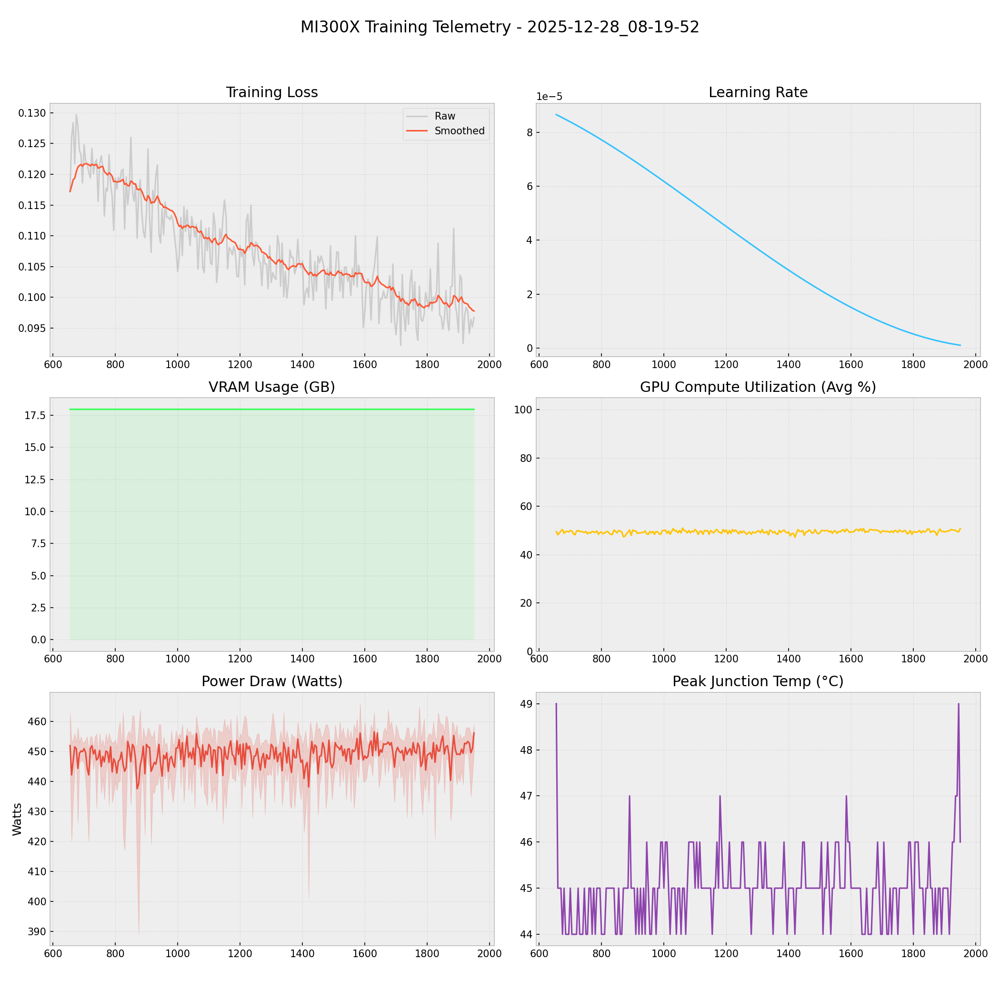

# 📑 Training Report — 2025-12-28_08-19-52

**Status:** 🔄 RUNNING  
**Project:** `docs`  

## 📊 Executive Summary
**Duration:** 19.19 hours  
**Steps:** 1950  
**Trainable Params:** 10,092,544 (0.12%)  
**Total Samples**:0

| Metric | Value |
|--------|-------|
| Samples Processed | 31,200 |
| **Initial Loss** | **0.1172** |
| **Final Loss** | **0.0967** |
| Peak VRAM | 17.97 GB |
| Avg VRAM | 17.97 GB |
| Avg GPU Utilization | 49.5 % |
| Avg Temp | 45.0 °C |
| **Peak Power** | **466.0 W** |
| Avg Power | 449.1 W |
| **Total Energy** | **8.6193 kWh** |

---

## 🖥️ MI300X Hardware Telemetry
> **Power Chart:** The shaded red region indicates the Min/Max fluctuation per step.



## ⚙️ Configuration Snapshot

| Hyperparameter | Value |
|----------------|-------|
| **Base Model** | `Qwen2_5_VLForConditionalGeneration` |
| **Precision** | `Bfloat16` |
| **Batch Size (Per GPU)** | `8` |
| **Grad Accumulation** | `2` |
| **Effective Batch Size** | `16` |
| **Learning Rate** | `0.0001` |
| **Optimizer** | `OptimizerNames.PAGED_ADAMW_8BIT` |

---

## 📝 Latest Logs
```json
[
  {
    "loss": 0.0964,
    "grad_norm": 0.5642120242118835,
    "learning_rate": 1.2683728031617104e-06,
    "epoch": 0.9360675512665863,
    "step": 1940,
    "timestamp": "2025-12-29T03:22:31.947998",
    "vram_gb": 17.971139907836914,
    "power_avg": 449.6,
    "power_min": 435.0,
    "power_max": 456.0,
    "temp": 47.0,
    "util": 49.6
  },
  {
    "loss": 0.0952,
    "grad_norm": 0.3759472668170929,
    "learning_rate": 1.1758499317246318e-06,
    "epoch": 0.9384800965018094,
    "step": 1945,
    "timestamp": "2025-12-29T03:26:58.308177",
    "vram_gb": 17.971139907836914,
    "power_avg": 451.0,
    "power_min": 442.0,
    "power_max": 455.0,
    "temp": 49.0,
    "util": 49.4
  },
  {
    "loss": 0.0967,
    "grad_norm": 0.4052155613899231,
    "learning_rate": 1.08679055242632e-06,
    "epoch": 0.9408926417370326,
    "step": 1950,
    "timestamp": "2025-12-29T03:31:24.659828",
    "vram_gb": 17.971139907836914,
    "power_avg": 456.2,
    "power_min": 450.0,
    "power_max": 459.0,
    "temp": 46.0,
    "util": 50.8
  }
]
```