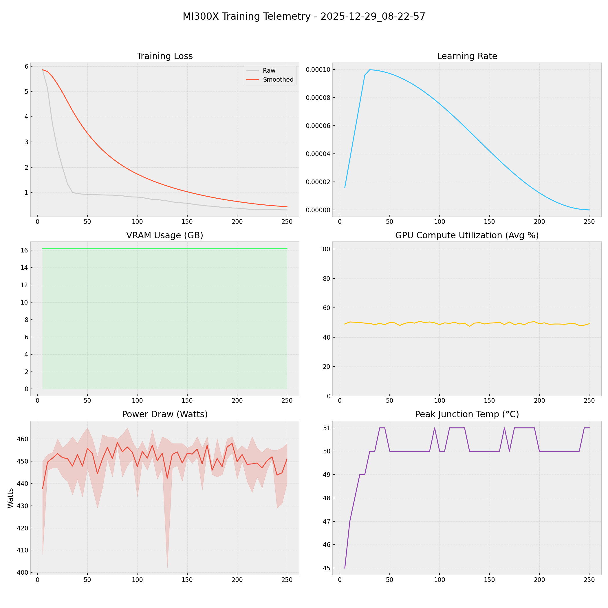

# 📑 Training Report — 2025-12-29_08-22-57

**Status:** ✅ COMPLETED  
**Project:** `docs`  

## 📊 Executive Summary
**Duration:** 0.37 hours  
**Steps:** 250  
**Trainable Params:** 10,092,544 (0.12%)  
**Total Samples**:0

| Metric | Value |
|--------|-------|
| Samples Processed | 8,000 |
| **Initial Loss** | **5.8661** |
| **Final Loss** | **0.3089** |
| Peak VRAM | 16.16 GB |
| Avg VRAM | 16.16 GB |
| Avg GPU Utilization | 49.4 % |
| Avg Temp | 50.1 °C |
| **Peak Power** | **465.0 W** |
| Avg Power | 451.1 W |
| **Total Energy** | **0.1668 kWh** |

---

## 🖥️ MI300X Hardware Telemetry
> **Power Chart:** The shaded red region indicates the Min/Max fluctuation per step.



## ⚙️ Configuration Snapshot

| Hyperparameter | Value |
|----------------|-------|
| **Base Model** | `Qwen2_5_VLForConditionalGeneration` |
| **Precision** | `Bfloat16` |
| **Batch Size (Per GPU)** | `8` |
| **Grad Accumulation** | `4` |
| **Effective Batch Size** | `32` |
| **Learning Rate** | `0.0001` |
| **Optimizer** | `OptimizerNames.PAGED_ADAMW_8BIT` |

---

## 📝 Latest Logs
```json
[
  {
    "loss": 0.3114,
    "grad_norm": 2.378720283508301,
    "learning_rate": 1.753570375247815e-07,
    "epoch": 0.23642943305186973,
    "step": 245,
    "timestamp": "2025-12-29T08:44:40.851698",
    "vram_gb": 16.159034729003906,
    "power_avg": 444.8,
    "power_min": 431.0,
    "power_max": 456.0,
    "temp": 51.0,
    "util": 48.2
  },
  {
    "loss": 0.3089,
    "grad_norm": 2.1822707653045654,
    "learning_rate": 4.873799534788059e-09,
    "epoch": 0.24125452352231605,
    "step": 250,
    "timestamp": "2025-12-29T08:45:06.531769",
    "vram_gb": 16.159034729003906,
    "power_avg": 451.0,
    "power_min": 440.0,
    "power_max": 458.0,
    "temp": 51.0,
    "util": 49.2
  },
  {
    "train_runtime": 1328.4957,
    "train_samples_per_second": 6.022,
    "train_steps_per_second": 0.188,
    "total_flos": 2.8159270004544307e+17,
    "train_loss": 0.9560246958732604,
    "epoch": 0.24125452352231605,
    "step": 250,
    "timestamp": "2025-12-29T08:45:07.771274",
    "vram_gb": 16.159034729003906,
    "power_avg": 0,
    "power_min": 0,
    "power_max": 0,
    "temp": 0,
    "util": 0
  }
]
```

## 🚀 HuggingFace Deployment
**Repo:** [Thunderbird2410/KAIO-SIGHT](https://huggingface.co/Thunderbird2410/KAIO-SIGHT)
**Commit:** `e9c78649d31adcc22bb9c8abe8be2e2b39b004c3`
**Adapter Config:** [adapter_config.json](https://huggingface.co/Thunderbird2410/KAIO-SIGHT/blob/e9c78649d31adcc22bb9c8abe8be2e2b39b004c3/adapter_config.json)


## 🚀 HuggingFace Deployment
**Repo:** [Thunderbird2410/KAIO-SIGHT](https://huggingface.co/Thunderbird2410/KAIO-SIGHT)
**Commit:** `ffc6f66e0d0f1f555e466b02fb346a2bfca402f2`
**Adapter Config:** [adapter_config.json](https://huggingface.co/Thunderbird2410/KAIO-SIGHT/blob/ffc6f66e0d0f1f555e466b02fb346a2bfca402f2/adapter_config.json)
