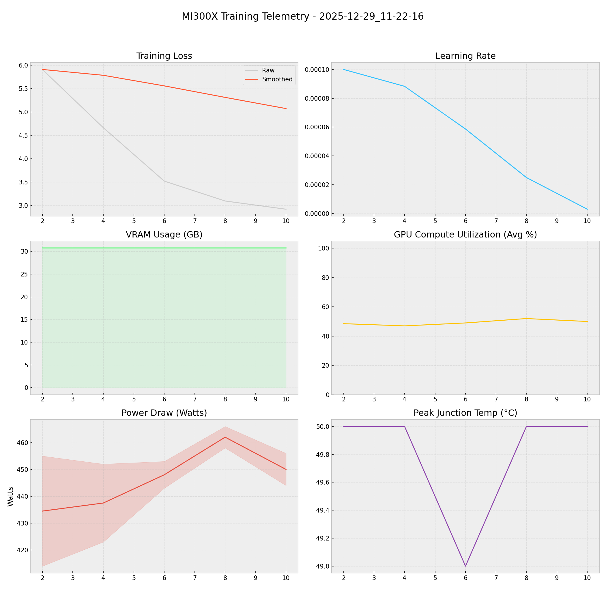

# 📑 Training Report — 2025-12-29_11-22-16

**Status:** ✅ COMPLETED  
**Project:** `docs`  

## 📊 Executive Summary
**Duration:** 0.12 hours  
**Steps:** 10  
**Trainable Params:** 10,092,544 (0.12%)  
**Total Samples**:0

| Metric | Value |
|--------|-------|
| Samples Processed | 640 |
| **Initial Loss** | **5.9085** |
| **Final Loss** | **2.9191** |
| Peak VRAM | 30.78 GB |
| Avg VRAM | 30.78 GB |
| Avg GPU Utilization | 49.3 % |
| Avg Temp | 49.8 °C |
| **Peak Power** | **466.0 W** |
| Avg Power | 446.4 W |
| **Total Energy** | **0.0528 kWh** |

---

## 🖥️ MI300X Hardware Telemetry
> **Power Chart:** The shaded red region indicates the Min/Max fluctuation per step.



## ⚙️ Configuration Snapshot

| Hyperparameter | Value |
|----------------|-------|
| **Base Model** | `Qwen2_5_VLForConditionalGeneration` |
| **Precision** | `Bfloat16` |
| **Batch Size (Per GPU)** | `8` |
| **Grad Accumulation** | `8` |
| **Effective Batch Size** | `64` |
| **Learning Rate** | `0.0001` |
| **Optimizer** | `OptimizerNames.PAGED_ADAMW_8BIT` |

---

## 📝 Latest Logs
```json
[
  {
    "loss": 3.095,
    "grad_norm": 4.092504024505615,
    "learning_rate": 2.500000000000001e-05,
    "epoch": 0.015440289505428226,
    "step": 8,
    "timestamp": "2025-12-29T11:28:07.035884",
    "vram_gb": 30.778027534484863,
    "power_avg": 462.0,
    "power_min": 458.0,
    "power_max": 466.0,
    "temp": 50.0,
    "util": 52.0
  },
  {
    "loss": 2.9191,
    "grad_norm": 3.9496042728424072,
    "learning_rate": 3.0153689607045845e-06,
    "epoch": 0.019300361881785282,
    "step": 10,
    "timestamp": "2025-12-29T11:29:20.651956",
    "vram_gb": 30.778027534484863,
    "power_avg": 450.0,
    "power_min": 444.0,
    "power_max": 456.0,
    "temp": 50.0,
    "util": 50.0
  },
  {
    "train_runtime": 423.5298,
    "train_samples_per_second": 1.511,
    "train_steps_per_second": 0.024,
    "total_flos": 8.0438088699691e+16,
    "train_loss": 4.021263885498047,
    "epoch": 0.019300361881785282,
    "step": 10,
    "timestamp": "2025-12-29T11:29:21.780183",
    "vram_gb": 17.537378311157227,
    "power_avg": 0,
    "power_min": 0,
    "power_max": 0,
    "temp": 0,
    "util": 0
  }
]
```

## 🚀 HuggingFace Deployment
**Repo:** [Thunderbird2410/KAIO-SIGHT](https://huggingface.co/Thunderbird2410/KAIO-SIGHT)
**Commit:** `c7e9029e40204d9ea3bceb1e2465be50a80da10e`
**Adapter Config:** [adapter_config.json](https://huggingface.co/Thunderbird2410/KAIO-SIGHT/blob/c7e9029e40204d9ea3bceb1e2465be50a80da10e/adapter_config.json)
